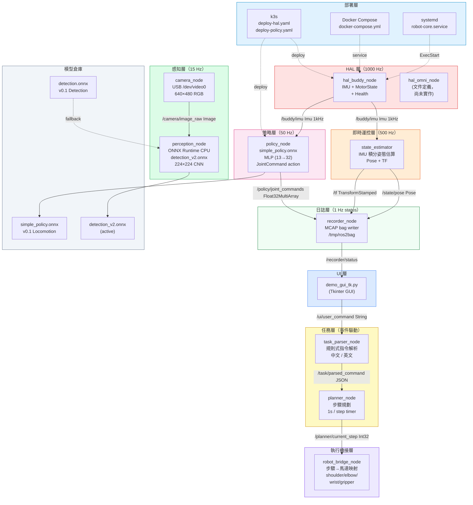
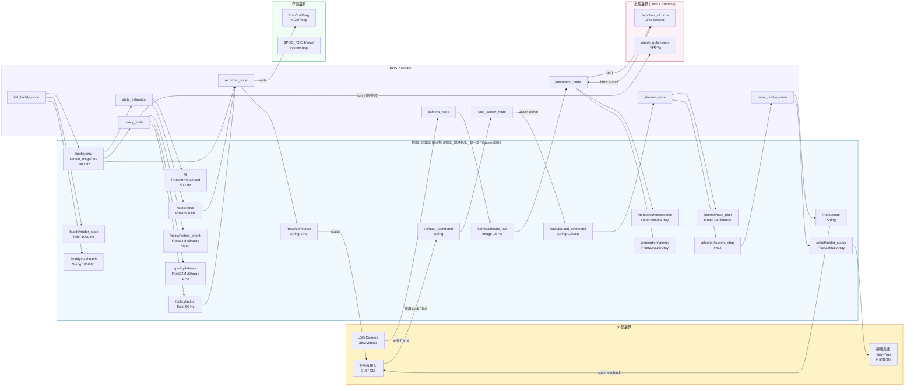
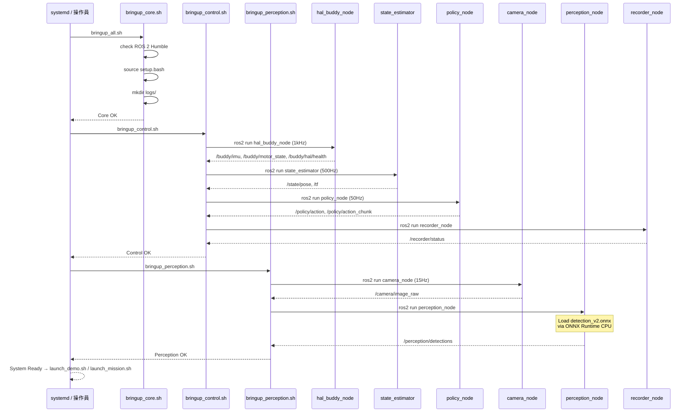

# Architecture & Data Flow Diagrams

## 1. 層次架構圖（模組 / 依賴）

---

## 2. 資料流圖（ROS 2 Topics / IPC 邊界）

---

## 3. Bring-up 啟動序列

---

## Topic 速查表

| Topic | Type | Hz | Publisher → Subscriber |
|-------|------|----|------------------------|
| `/ui/user_command` | String | event | GUI → task_parser |
| `/task/parsed_command` | String (JSON) | event | task_parser → planner |
| `/planner/current_step` | Int32 | 1/s | planner → robot_bridge |
| `/robot/state` | String | event | robot_bridge → GUI |
| `/robot/motor_status` | Float32MultiArray | event | robot_bridge → HW |
| `/buddy/imu` | sensor_msgs/Imu | 1000 | hal_buddy → state_estimator, policy, recorder |
| `/buddy/motor_state` | Twist | 1000 | hal_buddy |
| `/buddy/hal/health` | String | 1000 | hal_buddy |
| `/state/pose` | Pose | 500 | state_estimator → recorder |
| `/tf` | TransformStamped | 500 | state_estimator |
| `/camera/image_raw` | Image | 15 | camera_node → perception_node |
| `/perception/detections` | Detection2DArray | 15 | perception_node |
| `/perception/latency` | Float32MultiArray | 15 | perception_node |
| `/policy/action` | Twist | 50 | policy_node → recorder |
| `/policy/action_chunk` | Float32MultiArray | 50 | policy_node |
| `/policy/latency` | Float32MultiArray | 1 | policy_node |
| `/recorder/status` | String | 1 | recorder_node → GUI |
e → GUI |
