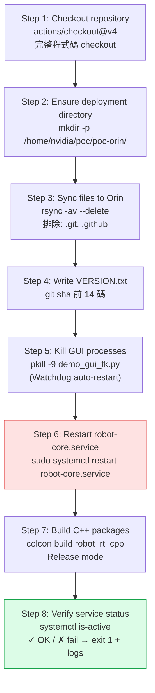
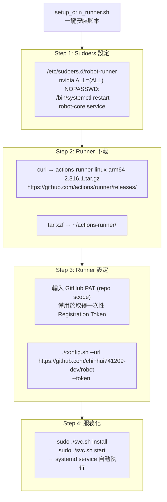
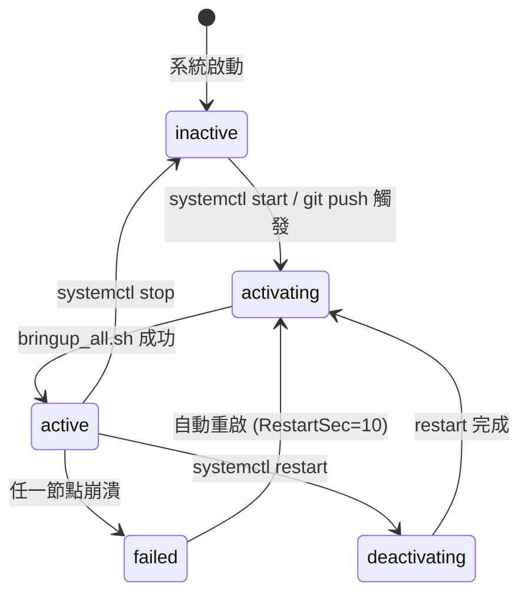
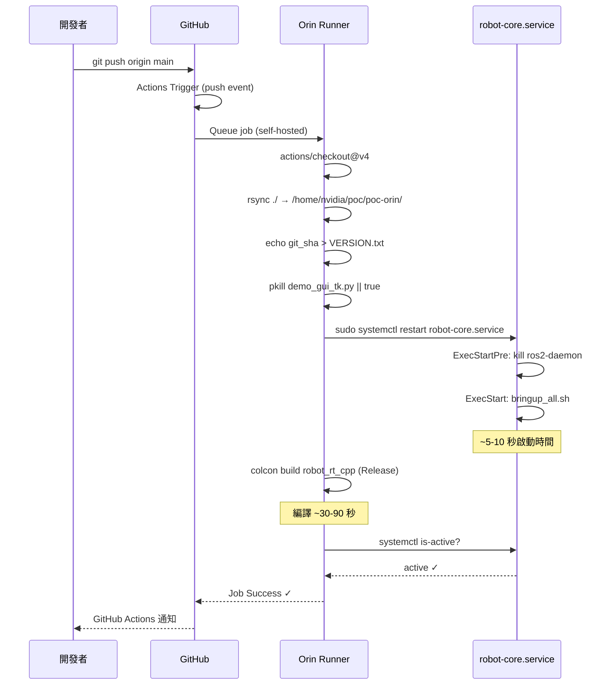

# CI/CD 架構文件 — Continuous Integration & Deployment

**文件版本：** v1.0  
**建立日期：** 2026-05-04  
**Repository：** `chinhui741209-dev/robot` (GitHub)  
**目標環境：** NVIDIA AGX Orin · `nvidia@192.168.99.73`

---

## 1. CI/CD 整體架構

```mermaid
flowchart LR
    subgraph DEV["開發端 (Developer)"]
        LOCAL["本地開發\n/Users/joeylin/code/Orin/robot"]
        GIT_PUSH["git push origin main"]
    end

    subgraph GITHUB["GitHub 雲端"]
        REPO["Repository\nchinhui741209-dev/robot"]
        ACTIONS["GitHub Actions\n.github/workflows/deploy-orin.yml"]
        TRIGGER["Trigger: push to main"]
    end

    subgraph ORIN["NVIDIA AGX Orin (Self-hosted Runner)"]
        RUNNER["GitHub Actions Runner\n~/actions-runner/\nARM64 aarch64\nv2.316.1"]
        RSYNC["rsync 同步\n./ → /home/nvidia/poc/poc-orin/\n(排除 .git, .github)"]
        VERSION["寫入 VERSION.txt\ngit sha (前14碼)"]
        BUILD["colcon build\n--packages-select robot_rt_cpp\n--cmake-args -DCMAKE_BUILD_TYPE=Release"]
        RESTART["sudo systemctl restart\nrobot-core.service"]
        VERIFY["systemctl is-active\nrobot-core.service\n失敗→ journalctl -n 50 + exit 1"]
    end

    subgraph SERVICE["系統服務"]
        SYSTEMD["robot-core.service\nRestart=on-failure\nRestartSec=10"]
        BRINGUP["bringup_all.sh\n→ bringup_core.sh\n→ bringup_control_cpp.sh\n→ bringup_perception.sh"]
    end

    LOCAL -->|"git commit + push"| GIT_PUSH
    GIT_PUSH --> REPO
    REPO --> TRIGGER
    TRIGGER --> ACTIONS
    ACTIONS -->|"通知 self-hosted runner"| RUNNER
    RUNNER --> RSYNC
    RSYNC --> VERSION
    VERSION --> BUILD
    BUILD --> RESTART
    RESTART --> VERIFY
    RESTART --> SYSTEMD
    SYSTEMD --> BRINGUP

    style DEV fill:#dbeafe,stroke:#3b82f6
    style GITHUB fill:#f3f4f6,stroke:#6b7280
    style ORIN fill:#dcfce7,stroke:#16a34a
    style SERVICE fill:#fef9c3,stroke:#ca8a04
```



---

## 2. GitHub Actions Workflow 規格

**檔案路徑：** `.github/workflows/deploy-orin.yml`

### 2.1 觸發條件

| 事件 | 分支 | 說明 |
|------|------|------|
| `push` | `main` | 每次 push 至 main 分支自動觸發 |
| 手動觸發 | — | 未設定（可透過 GitHub Actions UI 手動 re-run） |

### 2.2 Job 步驟



### 2.3 完整 Workflow 設定

```yaml
name: Deploy to Orin
on:
  push:
    branches: [main]
env:
  FORCE_JAVASCRIPT_ACTIONS_TO_NODE24: true

jobs:
  deploy:
    runs-on: self-hosted
    steps:
      - uses: actions/checkout@v4

      - name: Ensure deployment directory exists
        run: mkdir -p /home/nvidia/poc/poc-orin/

      - name: Sync files to Orin deployment directory
        run: |
          rsync -av --delete ./ /home/nvidia/poc/poc-orin/ \
            --exclude '.git' --exclude '.github'

      - name: Write version file
        run: echo "Build: ${{ github.sha }}" | cut -c 1-14 > /home/nvidia/poc/poc-orin/VERSION.txt

      - name: Trigger GUI Auto-Restart (Watchdog)
        run: |
          pkill -9 -f "demo_gui_tk.py" || true

      - name: Restart robot-core service
        run: sudo systemctl restart robot-core.service

      - name: Build C++ ROS 2 packages
        run: |
          source /opt/ros/humble/setup.bash
          cd /home/nvidia/poc/poc-orin
          colcon build --packages-select robot_rt_cpp \
            --cmake-args -DCMAKE_BUILD_TYPE=Release

      - name: Verify service status
        run: |
          if ! systemctl is-active --quiet robot-core.service; then
            sudo journalctl -u robot-core.service -n 50 --no-pager
            exit 1
          fi
          echo "Service robot-core.service is running."
```

---

## 3. Self-Hosted Runner 規格

### 3.1 Runner 環境

| 項目 | 值 |
|------|-----|
| 主機 | NVIDIA AGX Orin |
| 架構 | ARM64 (aarch64) |
| OS | Ubuntu 22.04.5 LTS |
| Runner 版本 | v2.316.1 |
| Runner 目錄 | `~/actions-runner/` |
| 執行帳號 | `nvidia` |
| 服務化 | Linux systemd service |
| 自動啟動 | 開機自動執行 |

### 3.2 Runner 安裝架構



### 3.3 Runner 管理指令

```bash
# 狀態查詢
cd ~/actions-runner && sudo ./svc.sh status

# 重啟 Runner
cd ~/actions-runner && sudo ./svc.sh restart

# 查看 Runner logs
sudo journalctl -u actions.runner.*.service -f

# 查看部署服務狀態
sudo systemctl status robot-core.service
sudo journalctl -u robot-core.service -n 50 --no-pager
```

---

## 4. systemd 服務設定

**檔案路徑：** `services/systemd/robot-core.service`

```ini
[Unit]
Description=Robot POC Core Service
After=network.target

[Service]
Type=simple
User=nvidia
WorkingDirectory=/home/nvidia/poc/poc-orin
Environment="ROS_DOMAIN_ID=42"
Environment="RMW_IMPLEMENTATION=rmw_cyclonedds_cpp"
Environment="ROS2Daemon=False"
Environment="PYTHONPATH=/home/nvidia/poc/poc-orin:$PYTHONPATH"
Environment="DISPLAY=:0"
Environment="XAUTHORITY=/home/nvidia/.Xauthority"
Environment="HOME=/home/nvidia"
ExecStartPre=/bin/bash -c 'source /opt/ros/humble/setup.bash && \
  pkill -9 ros2-daemon 2>/dev/null || true'
ExecStart=/home/nvidia/poc/poc-orin/bringup/bringup_all.sh
Restart=on-failure
RestartSec=10

[Install]
WantedBy=multi-user.target
```

### 服務生命週期



---

## 5. 測試整合

### 5.1 測試套件結構

```mermaid
flowchart LR
    subgraph UNIT["單元測試 (離線)"]
        T_SHM["test_shm_logic\nC++ Binary\nSHM 初始化驗證"]
        T_SAFE["test_safety_logic\nC++ Binary\nE-stop/Reset 邏輯"]
        T_INF["test_inference.py\n模型維度驗證\n(1,13)→(1,32)"]
    end

    subgraph BENCH["效能基準"]
        BENCH_RT["benchmark_rt\nC++ Binary\n5000 × 1kHz jitter\nP50/P95/P99/Max 報告"]
    end

    subgraph SMOKE["Smoke Tests"]
        SMOKE_SH["run_smoke_test.sh\nROS2 pkg list\nPython import\n模組存在性檢查"]
    end

    subgraph E2E["E2E 整合測試 (需 running nodes)"]
        E2E_SH["run_e2e_test.sh\n→ run_smoke_test.sh\n→ bringup_core.sh 流程"]
        T_CONTRACT["test_contracts.py\nROS2 Topic 合約驗證\n/buddy/imu 正規化檢查"]
        T_ORCH["test_orchestration.py\n任務層邏輯測試"]
    end

    UNIT --> BENCH
    BENCH --> SMOKE
    SMOKE --> E2E

    style UNIT fill:#dcfce7,stroke:#16a34a
    style BENCH fill:#fef9c3,stroke:#ca8a04
    style SMOKE fill:#dbeafe,stroke:#3b82f6
    style E2E fill:#fee2e2,stroke:#dc2626
```



### 5.2 測試執行指令

```bash
# 完整測試套件（在 Orin 上執行）
./scripts/run_all_unit_tests.sh

# 個別執行
rt_cpp/build/test_shm_logic        # C++ SHM 單元測試
rt_cpp/build/test_safety_logic     # C++ 安全邏輯
rt_cpp/build/benchmark_rt          # 1kHz jitter 基準 (需 sudo for RT)
pytest tests/test_inference.py -v  # Python 模型維度
pytest tests/ -v                   # 所有 Python 測試
./bringup/run_smoke_test.sh        # Smoke test
./bringup/run_e2e_test.sh          # E2E test
```

### 5.3 Jitter 驗證標準

| 指標 | 目標 | 測量工具 |
|------|------|---------|
| 1kHz 迴圈 P50 jitter | < 100 μs | `benchmark_rt` |
| 1kHz 迴圈 P99 jitter | < 500 μs | `benchmark_rt` |
| Policy 推理 avg | < 10 ms | `/policy/latency` topic |
| Perception 推理 avg | < 50 ms | `/perception/latency` topic |

---

## 6. 部署流程時序



---

## 7. 常見問題排除

| 問題 | 症狀 | 解法 |
|------|------|------|
| Runner 無法接收 Job | GitHub Actions pending | `cd ~/actions-runner && sudo ./svc.sh restart` |
| robot-core.service 啟動失敗 | `is-active` 回傳 failed | `journalctl -u robot-core.service -n 50` 查看錯誤 |
| colcon build 失敗 | C++ 編譯錯誤 | `source /opt/ros/humble/setup.bash` 後手動執行 |
| SHM 殘留 | 舊 SHM 未清理 | `shm_unlink /robot_shared_data` 或重啟 hal_buddy |
| E-stop 未清除 | 策略輸出被忽略 | `ros2 service call /estop_reset std_srvs/srv/Trigger` |
| RT priority 失敗 | jitter 劣化 | 以 `sudo` 啟動 hal_buddy 和 state_estimator |

---

## 8. 版本追蹤

| 檔案 | 說明 |
|------|------|
| `VERSION.txt` | 每次部署後由 CI 寫入當次 git commit sha (前 14 碼) |
| `git log` | 完整提交歷史 |
| `docs/baseline_manifest_v0.1.md` | v0.1 基線軟體清單 |

```bash
# 查詢 Orin 當前部署版本
cat /home/nvidia/poc/poc-orin/VERSION.txt

# 比對本地與部署版本
git rev-parse HEAD | cut -c 1-14
```
