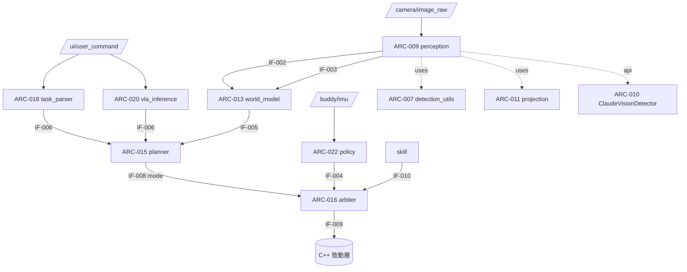

# 02 軟體架構（ARC / IF）

ASPICE SWE.2 / ISO 26262-6 §7。

## 元件 (ARC)

| ID | 元件 | 原始碼 | 職責 |
|---|---|---|---|
| ARC-001 | Obs 契約 | `policy/obs_utils.py` | 13 維觀測組裝、best_detection、quat→rpy（單一真實來源） |
| ARC-002 | Scripted Expert | `policy/scripted_expert.py` | BC 標籤來源（姿態保持 + 朝目標轉向） |
| ARC-003 | BC 訓練管線 | `scripts/collect_bc_dataset.py`, `models/build_dataset.py`, `models/train_policy.py`, `scripts/eval_policy.py`, `models/generate_simple_policy.py` | 收集→建集→訓練→匯出 ONNX→評估 |
| ARC-004 | Expert Node | `policy/expert_node.py` | 發布專家動作 + 錄製 (obs,act) |
| ARC-005 | Recorder Node | `middleware/recorder_node.py` | 配對錄製 (obs,act)（時效檢查） |
| ARC-006 | Sim Sensors | `sim/sim_sensors_node.py` | 合成 IMU + detection（sim 用） |
| ARC-007 | 偵測解碼器 | `perception/detection_utils.py` | YOLOv8 解碼 + per-class NMS（純） |
| ARC-008 | 類別設定 | `perception/classes.py` | 類別單一來源 + POC_ROOT 路徑解析 |
| ARC-009 | Perception Node | `perception/scripts/perception_node.py` | 偵測（onnx/api backend）+ 發布 2D/3D |
| ARC-010 | Claude 偵測後端 | `perception/api_backend.py` | 開放詞彙 Vision API 偵測 + 深度估計 |
| ARC-011 | 單目投影 | `perception/projection.py` | pinhole 反投影/投影（純） |
| ARC-012 | 物體追蹤器 | `world_model/tracker.py` | 持久化 present 追蹤（純） |
| ARC-013 | World Model Node | `world_model/scripts/world_model_node.py` | 場景圖 + 2D/3D 狀態廣播 |
| ARC-014 | 步驟邏輯 | `planner/step_logic.py` | StepSequencer + step_precondition + mode_for_step（純） |
| ARC-015 | Planner Node | `planner/scripts/planner_node.py` | 事件驅動規劃 + 模式發布 |
| ARC-016 | 動作鏈仲裁 | `arbiter/arbiter_logic.py`, `arbiter/scripts/arbiter_node.py` | policy(32)/skill(4) 仲裁（時效） |
| ARC-017 | 語言後端 | `task_parser/language_backend.py` | RuleBackend + LLMBackend（純 parse_rule） |
| ARC-018 | Task Parser Node | `task_parser/scripts/task_parser_node.py` | NL→parsed_command（rule/llm） |
| ARC-019 | VLA 大腦 | `policy/vla_brain.py` | 視覺+語言→任務計畫（Claude） |
| ARC-020 | VLA Node | `policy/vla_inference_node.py` | backend mock/api → 發 parsed_command |
| ARC-021 | 驗證 GUI | `gui/verify_web_gui.py` | 相機+偵測+遙測 web 儀表板 |
| ARC-022 | Policy Node | `policy/policy_node.py` | 50Hz ONNX 策略推論 → joint_commands |

> C++ RT 套件（`rt_cpp`、`robot_control_cpp`、`hal/src/*`）為現役致動/控制層，屬本軟體層文件的相鄰系統，介面見 IF。

## 介面 (IF)

| ID | 介面 | 型別 | 方向 |
|---|---|---|---|
| IF-001 | `/buddy/imu` | sensor_msgs/Imu | sim/HAL → policy/expert/recorder |
| IF-002 | `/perception/objects` | vision_msgs/Detection2DArray | perception → world_model/policy/GUI |
| IF-003 | `/perception/objects_3d` | vision_msgs/Detection3DArray | perception → world_model |
| IF-004 | `/policy/joint_commands` | std_msgs/Float32MultiArray[32] | policy/expert → arbiter/bridge |
| IF-005 | `/world_model/state` | std_msgs/String(JSON) | world_model → planner |
| IF-006 | `/task/parsed_command` | std_msgs/String(JSON) | task_parser/vla → planner |
| IF-007 | `/planner/current_step,/state,/status` | Int32/String | planner → 監看/GUI |
| IF-008 | `/arbiter/mode` | std_msgs/String | planner → arbiter |
| IF-009 | `/control/arbitrated_command` | std_msgs/Float32MultiArray | arbiter → (致動層) |
| IF-010 | `/control/target` | std_msgs/Float32MultiArray[4] | skill → bridge/arbiter |
| IF-011 | `/ui/user_command` | std_msgs/String | UI → task_parser/vla |
| IF-012 | obs13/act32 契約 | numpy (13,)/(32,) | 跨 BC 模組 |
| IF-013 | 偵測 dict | `{class,score,cx,cy,w,h,depth}` | 偵測後端 → perception_node |
| IF-014 | 憑證 | env `ANTHROPIC_API_KEY`/`ANTHROPIC_AUTH_TOKEN` | 環境 → API 後端（不進版控） |

## 靜態結構（mermaid）

