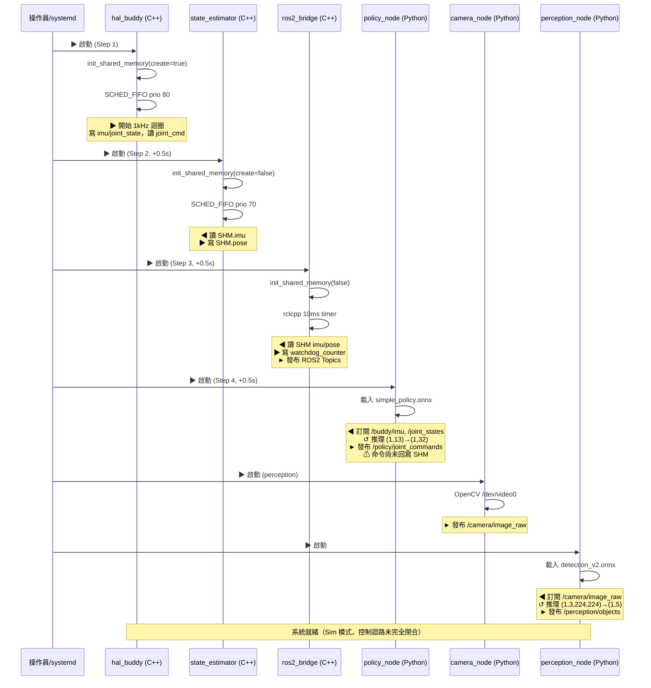

# 資料流規格 — Data Flow Specification

**文件版本：** v1.1  
**建立日期：** 2026-05-04  
**修訂日期：** 2026-05-04 — 補充單向/雙向方向標示、修正 JointCommand 未閉迴路問題  
**涵蓋範圍：** SHM IPC 路徑、ROS2 DDS 路徑、推理資料路徑、儲存路徑

---

## 0. 資料流方向分類速查

在此系統中，資料流分為三類：

| 符號 | 類型 | 說明 | 範例 |
|------|------|------|------|
| `A ──► B` | **單向** | 資料只從 A 流向 B | ROS2 Topic (Pub/Sub)、相機影像 |
| `A ◄──► B` | **雙向** | A、B 互相讀寫，但**欄位不同** | SHM（各進程讀寫各自負責的欄位）|
| `A ⇄ B` | **請求/回應** | A 發出請求，B 返回回應 | ROS2 Service (Client/Server) |
| `A ↺ B` | **in-process 函式呼叫** | 同進程內部呼叫，輸入→輸出 | ONNX Runtime、TensorRT |

> **重要說明：** ROS2 Topic 永遠是**單向**（Publisher → Subscriber）。  
> ROS2 Service 是**雙向請求/回應**（Client → Server → Client）。  
> POSIX SHM 中各進程各自負責不同欄位，整體呈**雙向**，但每個欄位的擁有者是固定的。

---

## 1. 完整資料流圖（含方向標示）

```mermaid
flowchart TD
    subgraph HARDWARE["硬體邊界 (Physical I/O)"]
        HW_IMU["IMU 感測器\n[Stub: static data]"]
        HW_MOTORS["馬達驅動器 × 32\n[Stub: write() no-op]"]
        HW_CAM["USB Camera\n/dev/video0\n640×480 MJPG @ 15 Hz"]
        USER["操作員 / 外部系統"]
    end

    subgraph SHM_LAYER["◄──► POSIX 共享記憶體 (/robot_shared_data) ◄──►\n各進程讀寫不同欄位，存取前必須持 pthread_mutex"]
        SHM_IMU["BuddyImu 88 B\nJointState 768 B\nimu_counter uint64\n← 由 hal_buddy 寫入 @1kHz"]
        SHM_CMD["JointCommand 1280 B\n← 待接：目前無進程寫入此欄位\n⚠ 控制迴路未閉合"]
        SHM_POSE["StatePose 64 B\npose_counter uint64\n← 由 state_estimator 寫入 @500Hz"]
        SHM_SAFE["estop_active bool\nwatchdog_counter uint64\nstop bool\n← 多進程共寫 (各有擁有者)"]
    end

    subgraph CPP_RT["C++ RT 進程"]
        HAL["hal_buddy\n1000 Hz / SCHED_FIFO prio 80\n▶ 寫: imu, joint_state, imu_counter\n◀ 讀: joint_cmd, watchdog_counter,\n    estop_active, stop"]
        ESTATE["state_estimator\n500 Hz / SCHED_FIFO prio 70\n◀ 讀: imu, imu_counter\n▶ 寫: pose, pose_counter\n⚡ 若 imu stale >50ms → estop_active=true"]
        BRIDGE["ros2_bridge\n100 Hz (rclcpp timer)\n◀ 讀: imu, joint_state, pose, stop\n▶ 寫: watchdog_counter++\n⚡ /estop_reset service: estop=false, reset counters"]
    end

    subgraph ROS2_BUS["ROS2 DDS 匯流排 ── 單向 Topic (Pub→Sub) ──"]
        direction LR
        T_IMU["► /buddy/imu\nsensor_msgs/Imu\n~316 B @ 100 Hz"]
        T_JS["► /joint_states\nsensor_msgs/JointState\n~1060 B @ 100 Hz"]
        T_POSE["► /state/pose\nPoseStamped ~72 B @ 100 Hz"]
        T_HEALTH["► /buddy/hal/health\nString ~5 B @ 100 Hz"]
        T_IMG["► /camera/image_raw\nImage ~900 KB @ 15 Hz"]
        T_OBJ["► /perception/objects\nDetection2DArray ~200 B @ 15 Hz"]
        T_JC["► /policy/joint_commands\nFloat32MultiArray[32]\n~144 B @ 50 Hz\n⚠ 目前無消費者接回 SHM"]
        T_ESTOP["► /estop\nBool 1 B (event-driven)"]
    end

    subgraph SVC["ROS2 Service ── 雙向請求/回應 ──"]
        SVC_RESET["⇄ /estop_reset\nstd_srvs/Trigger\nRequest: (empty)\nResponse: success bool\n         message string"]
    end

    subgraph PYTHON_NODES["Python 節點"]
        POLICY["policy_node\n50 Hz\n訂閱: /buddy/imu,\n/joint_states,\n/perception/objects"]
        CAM_NODE["camera_node\n15 Hz"]
        PERC["perception_node\n15 Hz"]
        RECORDER["recorder_node\nasync"]
    end

    subgraph INFERENCE["↺ In-Process 函式呼叫（非 IPC）"]
        ORT_P["↺ ONNX Runtime CPU\nsimple_policy.onnx\nin: (1,13) float32\nout: (1,32) float32"]
        ORT_D["↺ ONNX Runtime CPU\ndetection_v2.onnx\nin: (1,3,224,224) float32\nout: (1,5) float32"]
        TRT_P["↺ TensorRT .engine\n(預留，優先於 ORT)"]
        TRT_D["↺ TensorRT .engine\n(預留，優先於 ORT)"]
    end

    subgraph STORAGE["儲存層 (寫入單向)"]
        MCAP["/tmp/ros2bag/*.mcap\nMCAP bag"]
        LOGS["$POC_ROOT/logs/*.log\nProcess stdout"]
    end

    %% === 硬體 → HAL (單向) ===
    HW_IMU -->|"① 單向 read()\n靜態 stub 資料"| HAL
    HW_MOTORS -.->|"② 單向 write() [no-op]\n命令送出，無回饋"| HAL

    %% === HAL ↔ SHM (雙向，不同欄位) ===
    HAL -->|"③ ▶ 寫 imu+joint_state\n~856 B @ 1kHz"| SHM_IMU
    HAL -->|"⑥ ▶ 寫 estop_active\n(watchdog 觸發)"| SHM_SAFE
    SHM_CMD -->|"④ ◀ 讀 joint_cmd\n(目前全為 0)"| HAL
    SHM_SAFE -->|"⑤ ◀ 讀 watchdog_counter\nestop_active, stop"| HAL

    %% === state_estimator ↔ SHM (雙向) ===
    SHM_IMU -->|"⑦ ◀ 讀 imu + imu_counter\n@500Hz"| ESTATE
    ESTATE -->|"⑧ ▶ 寫 pose + pose_counter\n64 B @ 500Hz"| SHM_POSE
    ESTATE -->|"⑨ ▶ 寫 estop_active\n(IMU stale >50ms)"| SHM_SAFE

    %% === ros2_bridge ↔ SHM (雙向) ===
    SHM_IMU -->|"⑩ ◀ 讀 imu+joint_state\n@100Hz"| BRIDGE
    SHM_POSE -->|"⑪ ◀ 讀 pose\n@100Hz"| BRIDGE
    BRIDGE -->|"⑫ ▶ 寫 watchdog_counter++\n@100Hz (heartbeat)"| SHM_SAFE

    %% === ros2_bridge → ROS2 Topics (單向 Pub) ===
    BRIDGE -->|"⑬ 單向 Publish"| T_IMU
    BRIDGE -->|"⑭ 單向 Publish"| T_JS
    BRIDGE -->|"⑮ 單向 Publish"| T_POSE
    BRIDGE -->|"⑯ 單向 Publish"| T_HEALTH

    %% === ROS2 Service ⇄ Bridge (雙向 req/resp) ===
    USER -->|"⑰ 單向 呼叫 service"| SVC_RESET
    SVC_RESET <-->|"⑱ 雙向 req/resp\n(Trigger)"| BRIDGE
    BRIDGE -->|"⑲ ▶ 寫 estop=false\ncounters=0"| SHM_SAFE

    %% === E-stop topic → Bridge (單向) ===
    USER -->|"⑳ 單向 ros2 pub"| T_ESTOP
    T_ESTOP -->|"㉑ 單向 Subscribe"| BRIDGE
    BRIDGE -->|"㉒ ▶ 寫 estop=true"| SHM_SAFE

    %% === Camera (單向) ===
    HW_CAM -->|"㉓ 單向 v4l2\n900 KB @ 15Hz"| CAM_NODE
    CAM_NODE -->|"㉔ 單向 Publish"| T_IMG

    %% === Perception in-process (↺) ===
    T_IMG -->|"㉕ 單向 Subscribe"| PERC
    PERC -->|"㉖ ↺ 函式呼叫\nresize+preprocess"| ORT_D
    PERC -->|"㉗ ↺ 函式呼叫 (優先)"| TRT_D
    ORT_D -->|"㉘ ↺ 返回 (1,5)"| PERC
    PERC -->|"㉙ 單向 Publish"| T_OBJ

    %% === Policy in-process (↺) ===
    T_IMU -->|"㉚ 單向 Subscribe"| POLICY
    T_JS -->|"㉛ 單向 Subscribe"| POLICY
    T_OBJ -->|"㉜ 單向 Subscribe"| POLICY
    POLICY -->|"㉝ ↺ 函式呼叫\n(1,13) in"| ORT_P
    POLICY -->|"㉞ ↺ 函式呼叫 (優先)"| TRT_P
    ORT_P -->|"㉟ ↺ 返回 (1,32)"| POLICY
    POLICY -->|"㊱ 單向 Publish"| T_JC

    %% === ⚠ 未接通的迴路 ===
    T_JC -.->|"⚠ ㊲ 缺少訂閱者\n無進程寫回 SHM.joint_cmd\n控制迴路未閉合"| SHM_CMD

    %% === Recorder (單向寫入) ===
    T_IMU -->|"㊳ 單向 Subscribe"| RECORDER
    T_POSE -->|"㊴ 單向 Subscribe"| RECORDER
    T_JC -->|"㊵ 單向 Subscribe"| RECORDER
    RECORDER -->|"㊶ 單向 write"| MCAP

    %% === Logs (單向) ===
    HAL -->|"㊷ 單向 stdout"| LOGS
    ESTATE -->|"㊸ 單向 stdout"| LOGS

    style HARDWARE fill:#fef3c7,stroke:#d97706
    style SHM_LAYER fill:#fee2e2,stroke:#dc2626
    style CPP_RT fill:#ffedd5,stroke:#ea580c
    style ROS2_BUS fill:#e0f2fe,stroke:#0284c7
    style SVC fill:#dbeafe,stroke:#3b82f6
    style PYTHON_NODES fill:#dcfce7,stroke:#16a34a
    style INFERENCE fill:#fdf2f8,stroke:#be185d
    style STORAGE fill:#f0fdf4,stroke:#15803d
    style SHM_CMD fill:#fee2e2,stroke:#dc2626,color:#dc2626
```



---

## 2. SHM 欄位擁有者與讀寫方向

> SHM 是**多進程共用區域**，整體為雙向，但每個欄位的**寫入者固定**，讀取者可多個。

| 欄位 | 大小 | 方向 | 寫入者 | 讀取者 | 更新頻率 |
|------|------|------|--------|--------|---------|
| `imu` (BuddyImu) | 88 B | ▶ 單向寫入 | hal_buddy | state_estimator, ros2_bridge | 1000 Hz |
| `joint_state` (JointState) | 768 B | ▶ 單向寫入 | hal_buddy | ros2_bridge | 1000 Hz |
| `imu_counter` | 8 B | ▶ 單向遞增 | hal_buddy | state_estimator（watchdog 監控）| 1000 Hz |
| `joint_cmd` (JointCommand) | 1280 B | ▶ **⚠ 無寫入者** | (缺失) | hal_buddy | — |
| `pose` (StatePose) | 64 B | ▶ 單向寫入 | state_estimator | ros2_bridge | 500 Hz |
| `pose_counter` | 8 B | ▶ 單向遞增 | state_estimator | — | 500 Hz |
| `watchdog_counter` | 8 B | ▶ 單向遞增 | ros2_bridge | hal_buddy（watchdog 監控）| 100 Hz |
| `estop_active` | 1 B | ◄──► **多寫入者** | hal_buddy (觸發) / state_estimator (觸發) / ros2_bridge (重置) | hal_buddy（執行 E-stop 動作）| event |
| `stop` | 1 B | ▶ 單向寫入 | hal_buddy（自身）| ros2_bridge、state_estimator | event |

### ⚠ 已知缺口：JointCommand 迴路未閉合

```
policy_node ──► /policy/joint_commands (Float32MultiArray) ──► [無訂閱者]
                                                                      ↕ 缺少
                                                              SHM.joint_cmd ◄── hal_buddy 讀取
```

**影響：** 目前 `SHM.joint_cmd` 全為 0，`hal_buddy` 讀到的命令是零扭矩。控制迴路**尚未端到端閉合**。  
**修復方向：** 在 `ros2_bridge.cpp` 增加訂閱 `/policy/joint_commands`，將 Float32MultiArray[32] 映射回 `SHM.joint_cmd.q_des[32]`。

---

## 3. ROS2 通訊方向詳細規格

### 3.1 Topic（單向 Pub/Sub）

所有 Topic 均為**單向**，資料從 Publisher 流向所有 Subscriber，**無回應機制**。

| Topic | 方向 | Publisher | Subscriber(s) | 頻率 | 封包大小 | 吞吐量 |
|-------|------|-----------|---------------|------|---------|--------|
| `/buddy/imu` | ► 單向 | ros2_bridge | policy_node, recorder | 100 Hz | ~316 B | 31.6 KB/s |
| `/joint_states` | ► 單向 | ros2_bridge | policy_node, recorder | 100 Hz | ~1,060 B | 106 KB/s |
| `/state/pose` | ► 單向 | ros2_bridge | recorder | 100 Hz | ~72 B | 7.2 KB/s |
| `/buddy/hal/health` | ► 單向 | ros2_bridge | monitor | 100 Hz | ~5 B | 0.5 KB/s |
| `/camera/image_raw` | ► 單向 | camera_node | perception_node | 15 Hz | ~921,600 B | **13.5 MB/s** |
| `/perception/objects` | ► 單向 | perception_node | policy_node | 15 Hz | ~200 B | 3 KB/s |
| `/perception/scene_state` | ► 單向 | perception_node | — | 15 Hz | ~150 B | 2.3 KB/s |
| `/perception/latency` | ► 單向 | perception_node | — | 1 Hz | 8 B | <1 KB/s |
| `/policy/joint_commands` | ► 單向 | policy_node | **⚠ 無** | 50 Hz | ~144 B | 7.2 KB/s |
| `/policy/action_chunk` | ► 單向 | policy_node | recorder | 50 Hz | ~148 B | 7.4 KB/s |
| `/policy/latency` | ► 單向 | policy_node | — | 1 Hz | 8 B | <1 KB/s |
| `/estop` | ► 單向 | 任意外部 | ros2_bridge | event | 1 B | — |
| `/estop_reset` (topic) | ► 單向 | 任意外部 | ros2_bridge | event | 1 B | — |
| `/ui/user_command` | ► 單向 | GUI/CLI | task_parser | event | ~50 B | — |
| `/task/parsed_command` | ► 單向 | task_parser | planner | event | ~100 B | — |
| `/planner/current_step` | ► 單向 | planner | robot_bridge | 1 Hz | 4 B | — |
| `/robot/state` | ► 單向 | robot_bridge | GUI | event | ~20 B | — |
| `/recorder/status` | ► 單向 | recorder | GUI | 1 Hz | ~10 B | — |

### 3.2 Service（雙向請求/回應）

| Service | 方向 | Client | Server | Request 大小 | Response 大小 | 說明 |
|---------|------|--------|--------|------------|--------------|------|
| `/estop_reset` | ⇄ 雙向 req/resp | 任意外部（ros2 service call）| ros2_bridge | 0 B (empty) | ~50 B (success bool + message string) | 清除 E-stop + 計數器重置，有明確回應確認 |

> **Topic vs Service 的安全考量：**  
> `/estop_reset` 同時存在 Topic（Bool）與 Service（Trigger）兩種接口：
> - **Topic** 版本：fire-and-forget，無確認回應，適合緊急觸發
> - **Service** 版本：有 `success/message` 回應，適合需要確認重置成功的場景（稽核日誌、操作 UI）

---

## 4. 推理路徑（In-Process 函式呼叫）

推理引擎是**進程內的函式呼叫**，不跨越 IPC 邊界，不使用 socket 或共享記憶體。

### 4.1 策略推理（policy_node 內部）

```
direction: ↺ in-process call

呼叫端: policy_node._publish_action()
        ↓
輸入: numpy float32 (1, 13)
      [qx, qy, qz, qw, gx, gy, gz, ax, ay, az, det_cx, det_cy, det_conf]
        ↓
backend 優先序:
  1. TRTInference.run(input)   ← 優先（若 .engine 存在）
  2. ort.InferenceSession.run() ← fallback
  3. sin(t) mock output         ← 無模型時 fallback
        ↓
輸出: numpy float32 (1, 32)
      [q_des_0 ... q_des_31]  ∈ [-1.0, 1.0]
        ↓
發布端: /policy/joint_commands (Float32MultiArray[32])
```

### 4.2 物件偵測推理（perception_node 內部）

```
direction: ↺ in-process call

呼叫端: perception_node._image_callback()
        ↓
輸入: 640×480 BGR frame (numpy uint8)
  → resize to 224×224
  → normalize [0,255] → [0,1]
  → reshape (1, 3, 224, 224) float32
        ↓
backend 優先序:
  1. TRTInference.run(input)    ← 優先（若 .engine 存在）
  2. ort.InferenceSession.run() ← fallback
        ↓
輸出: numpy float32 (1, 5)
      [cx, cy, w, h, confidence]
      confidence 閾值: 0.5
      類別: "pen", "box"
        ↓
發布端: /perception/objects (Detection2DArray)
        /perception/scene_state (String JSON)
```

---

## 5. SHM 資料結構規格

### 5.1 共享記憶體區段（讀寫欄位總覽）

| 欄位 | 類型 | 大小 | 讀寫方向 | 備註 |
|------|------|------|---------|------|
| `mutex` | `pthread_mutex_t` | 40 B | ◄──► | PTHREAD_PROCESS_SHARED |
| `imu` | `BuddyImu` | 88 B | ▶ hal_buddy 寫 | — |
| `joint_state` | `JointState` | 768 B | ▶ hal_buddy 寫 | — |
| `joint_cmd` | `JointCommand` | 1280 B | **⚠ 無寫入者** | 控制迴路缺口 |
| `pose` | `StatePose` | 64 B | ▶ state_estimator 寫 | — |
| `stop` | `bool` | 1 B | ▶ hal_buddy 寫 | — |
| `estop_active` | `bool` | 1 B | ◄──► 多進程讀寫 | 任意進程可設 true；僅 /estop_reset 可清除 |
| `watchdog_counter` | `uint64_t` | 8 B | ▶ ros2_bridge 遞增 | hal_buddy 監控此值 |
| `imu_counter` | `uint64_t` | 8 B | ▶ hal_buddy 遞增 | state_estimator 監控此值 |
| `pose_counter` | `uint64_t` | 8 B | ▶ state_estimator 遞增 | — |
| *(padding)* | — | ~6 B | — | 對齊 |
| **合計** | | **≈ 2,272 B** | | |

### 5.2 BuddyImu 欄位規格

| 欄位 | 類型 | 單位 | 說明 |
|------|------|------|------|
| `timestamp` | `int64_t` | μs | `steady_clock` 微秒 |
| `orientation[4]` | `double` | — | 四元數 [x,y,z,w]，正規化（\|q\|=1） |
| `angular_velocity[3]` | `double` | rad/s | [x,y,z] |
| `linear_acceleration[3]` | `double` | m/s² | 含重力（靜止 z≈9.81） |

### 5.3 JointCommand 欄位規格

| 欄位 | 類型 | 單位 | 說明 |
|------|------|------|------|
| `q_des[32]` | `double` | rad | 目標關節位置 |
| `dq_des[32]` | `double` | rad/s | 目標關節速度 |
| `kp[32]` | `double` | Nm/rad | 比例增益 |
| `kd[32]` | `double` | Nm·s/rad | 微分增益 |
| `tau_ff[32]` | `double` | Nm | 前饋扭矩 |

> **E-stop 行為：** `estop_active=true` → hal_buddy 強制 `tau_ff=kp=kd=0`。

---

## 6. 資料吞吐量彙總

| 資料路徑 | 方向 | 速率 | 每次資料量 | 總吞吐量 | 備註 |
|---------|------|------|-----------|---------|------|
| SHM HAL 寫 (imu+js) | ▶ 單向 | 1000 Hz | 856 B | **856 KB/s** | 最高頻率 |
| SHM SE 寫 (pose) | ▶ 單向 | 500 Hz | 64 B | 32 KB/s | |
| SHM Bridge 讀 | ◀ 單向 | 100 Hz | ~2,272 B | 227 KB/s | |
| SHM Bridge 寫 watchdog | ▶ 單向 | 100 Hz | 8 B | 0.8 KB/s | heartbeat |
| Camera → Perception | ► 單向 | 15 Hz | 921,600 B | **13.5 MB/s** | 最大封包 |
| ROS2 /buddy/imu | ► 單向 | 100 Hz | 316 B | 31.6 KB/s | |
| ROS2 /joint_states | ► 單向 | 100 Hz | 1,060 B | 106 KB/s | |
| Policy 推理 in | ↺ in-process | 50 Hz | 52 B (13×4) | 2.6 KB/s | |
| Policy 推理 out | ↺ in-process | 50 Hz | 128 B (32×4) | 6.4 KB/s | |
| MCAP 錄製 | ▶ 單向 | async | 變動 | ~1-2 MB/s | |
| /estop_reset service | ⇄ req/resp | event | req: 0 B, resp: ~50 B | — | |

---

## 7. LCM 訊息規格（Legacy 路徑）

> ⚠ Python/LCM 路徑已廢棄（`hal_buddy_node.py` 有 DEPRECATED 警告），僅供相容性參考。  
> LCM channel **全為單向廣播**（publish/subscribe），無 req/resp 機制。

| 頻道 | 方向 | 大小 | 頻率 | 目前狀態 |
|------|------|------|------|---------|
| `BUDDY_IMU` | ► 單向 | 88 B | 1000 Hz | Deprecated |
| `BUDDY_JOINT_STATE` | ► 單向 | 776 B | 1000 Hz | Deprecated |
| `BUDDY_JOINT_CMD` | ► 單向 | 1288 B | 50 Hz | Deprecated |
| `BUDDY_MOTOR_STATE` | ► 單向 | 56 B | 1000 Hz | Deprecated |
| `BUDDY_HAL_HEALTH` | ► 單向 | ~3 B | 1000 Hz | Deprecated |
| `STATE_POSE` | ► 單向 | 64 B | 500 Hz | Deprecated |

---

## 8. Watchdog 時序（雙向監控關係）

```
┌─────────────────────────────────────────────────────────────┐
│  Watchdog 是雙進程間的「健康心跳」，本質上是雙向監控：          │
│  A 寫計數器 ──► B 讀計數器（B 監控 A 是否還活著）              │
└─────────────────────────────────────────────────────────────┘

hal_buddy (1000 Hz)
  ▶ 每 1ms:  SHM.imu_counter++          (hal_buddy 活著的證明)
  ◀ 監控:    SHM.watchdog_counter
             若 100 ms 無變化 → estop_active = true  (橋接器/控制器死掉)

state_estimator (500 Hz)
  ▶ 每 2ms:  SHM.pose_counter++
  ◀ 監控:    SHM.imu_counter
             若 50 ms 無變化 → estop_active = true   (HAL 死掉)

ros2_bridge (100 Hz)
  ▶ 每 10ms: SHM.watchdog_counter++     (控制器活著的心跳)

/estop_reset service (event)
  ▶ 重置:    estop_active=false, imu_counter=0, pose_counter=0
  ◀ 回應:    success=true, message="E-Stop cleared; counters reset"
```

---

## 9. 啟動資料流時序


