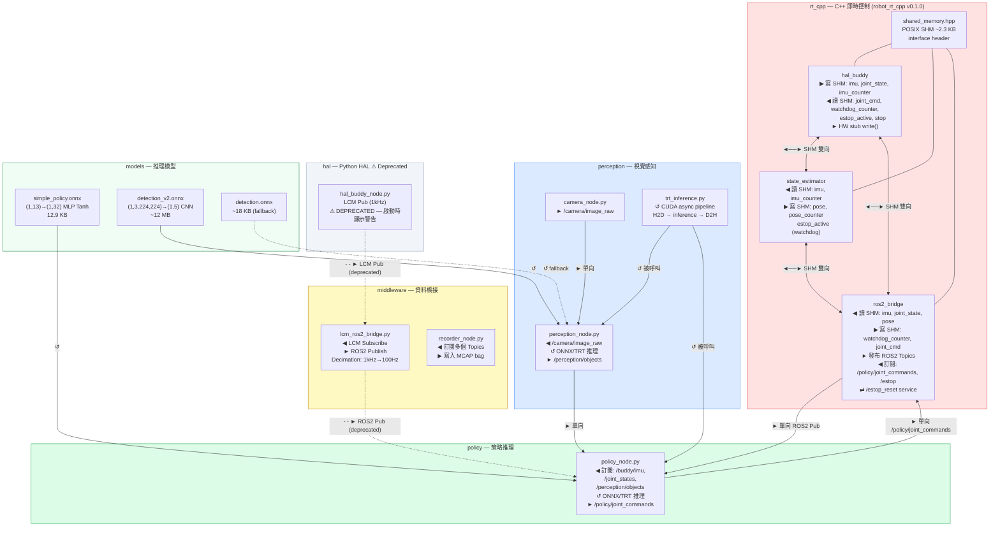
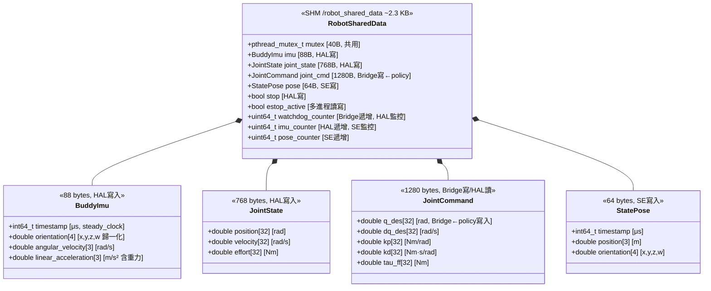
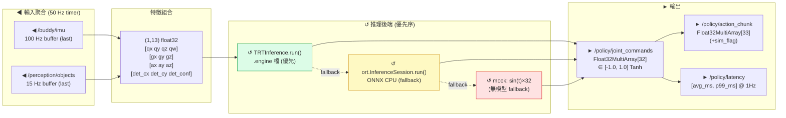
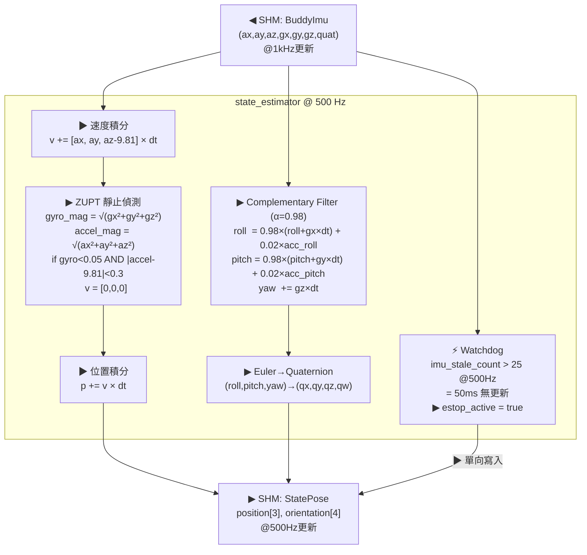

# 軟體架構圖 — Orin Robot Software Architecture

**文件版本：** v1.1  
**建立日期：** 2026-05-04  
**修訂日期：** 2026-05-04 — 補充單向/雙向方向標示、補上 JointCommand 閉迴路  
**ROS 版本：** ROS 2 Humble Hawksbill  
**語言：** C++17 (RT 層) / Python 3.10 (策略、感知層)

---

## 0. 方向標示說明

| 符號 | 類型 | 範例 |
|------|------|------|
| `──►` | **單向**（Pub/Sub Topic） | `/buddy/imu`、`/camera/image_raw` |
| `◄──►` | **雙向**（各讀寫不同欄位） | SHM 各進程、Watchdog 計數器 |
| `⇄` | **請求/回應**（ROS2 Service） | `/estop_reset` Trigger |
| `↺` | **In-process 呼叫**（非 IPC） | ONNX Runtime、TensorRT |
| `- - ►` | **選用/fallback/待啟用** | TRT 路徑、LCM legacy |

---

## 1. 軟體模組全覽（含介面方向）



---

## 2. C++ SHM 介面詳細設計（讀寫擁有者）



---

## 3. JointCommand 閉迴路（已修復）

```mermaid
flowchart LR
    POL["policy_node\n50 Hz\n↺ ONNX推理\n(1,13)→(1,32)"]
    TOPIC["► /policy/joint_commands\nFloat32MultiArray[32]\n單向 Topic @ 50 Hz"]
    BRIDGE["ros2_bridge\n◀ 訂閱並接收"]
    SHM_CMD["SHM.joint_cmd.q_des[32]\n◄──► bridge寫 / HAL讀"]
    HAL["hal_buddy\n◀ 讀 joint_cmd\n@1kHz"]
    HW["HardwareInterfaceStub\n.write(joint_cmd)\n[stub: no-op]"]

    POL -->|"► 單向 Publish"| TOPIC
    TOPIC -->|"► 單向 Subscribe callback"| BRIDGE
    BRIDGE -->|"▶ mutex lock 寫入\nq_des[0..31]\nestop guard"| SHM_CMD
    SHM_CMD -->|"◀ mutex lock 讀取"| HAL
    HAL -->|"► 單向\n(stub no-op)"| HW

    style SHM_CMD fill:#dcfce7,stroke:#16a34a
    style HW fill:#fef9c3,stroke:#ca8a04
```



**安全保護：**
- `estop_active == true` 時，`joint_cmd_callback` 直接 return，**不更新 joint_cmd**
- 收到 data.size() < 32 時，WARN_ONCE 並忽略，**不做部分寫入**

---

## 4. 策略推理管線（In-Process 方向）



---

## 5. 狀態估計演算法（資料方向）



---

## 6. 模組責任邊界（含方向）

| 模組 | 語言 | 頻率 | SHM 方向 | ROS2 方向 | 主要責任 |
|------|------|------|---------|---------|---------|
| `hal_buddy` | C++17 | 1000 Hz | ▶ 寫 imu/js ◀ 讀 cmd | — | 硬體 I/O、Watchdog 觸發 |
| `state_estimator` | C++17 | 500 Hz | ◀ 讀 imu ▶ 寫 pose | — | CF 姿態、ZUPT、Watchdog |
| `ros2_bridge` | C++17+rclcpp | 100 Hz | ◀ 讀 ▶ 寫 cmd/watchdog | ► Pub ◀ Sub ⇄ Srv | SHM↔DDS 橋接、E-stop 服務 |
| `policy_node` | Python 3 | 50 Hz | — | ◀ Sub ► Pub | 13D→32D 推理、感知融合 |
| `perception_node` | Python 3 | 15 Hz | — | ◀ Sub ► Pub | 物件偵測 |
| `camera_node` | Python 3 | 15 Hz | — | ► Pub | USB 攝影機採集 |
| `recorder_node` | Python 3 | async | — | ◀ Sub | MCAP bag 錄製 |

---

## 7. Build 系統

### C++ (colcon + CMake)

```
robot_rt_cpp (package.xml v0.1.0)
  依賴: rclcpp, sensor_msgs, geometry_msgs, std_msgs,
        std_srvs, nav_msgs, pthread, rt
  標準: C++17, -Wall -Wextra -Wpedantic
  產出:
    hal_buddy        — standalone RT binary (SCHED_FIFO prio 80)
    state_estimator  — standalone RT binary (SCHED_FIFO prio 70)
    ros2_bridge      — rclcpp node (100 Hz timer)
    test_shm_logic   — unit test binary
    test_safety_logic — unit test binary
    benchmark_rt     — 1kHz jitter benchmark (5000 iterations)
```

### Python 依賴

```
numpy         — 數值運算、tensor 組裝
onnxruntime   — CPU 推理後端
opencv-python — v4l2 採集、影像前處理
torch         — 模型訓練/ONNX 匯出（離線開發機用）
tensorrt      — GPU 推理（JetPack 預裝，Python API 待啟用）
pycuda        — TRT CUDA 記憶體管理
lcm           — LCM 序列化（Legacy 路徑用）
pytest        — 單元測試
```
