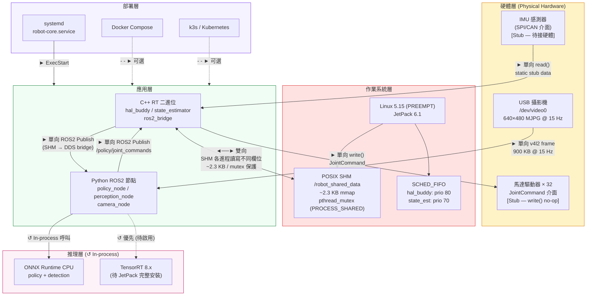
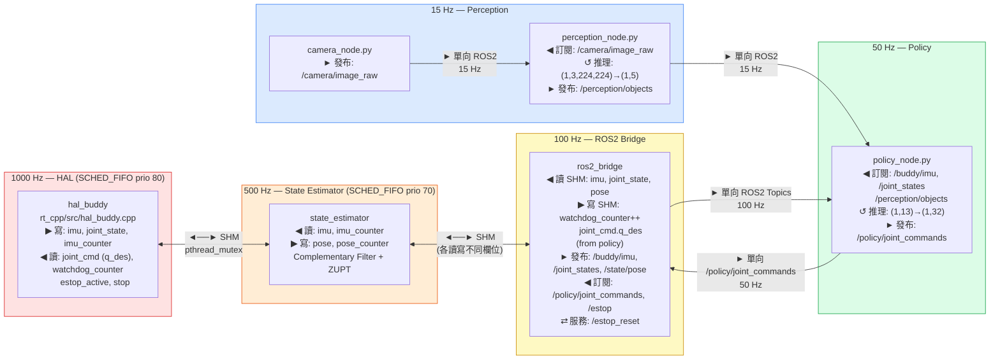
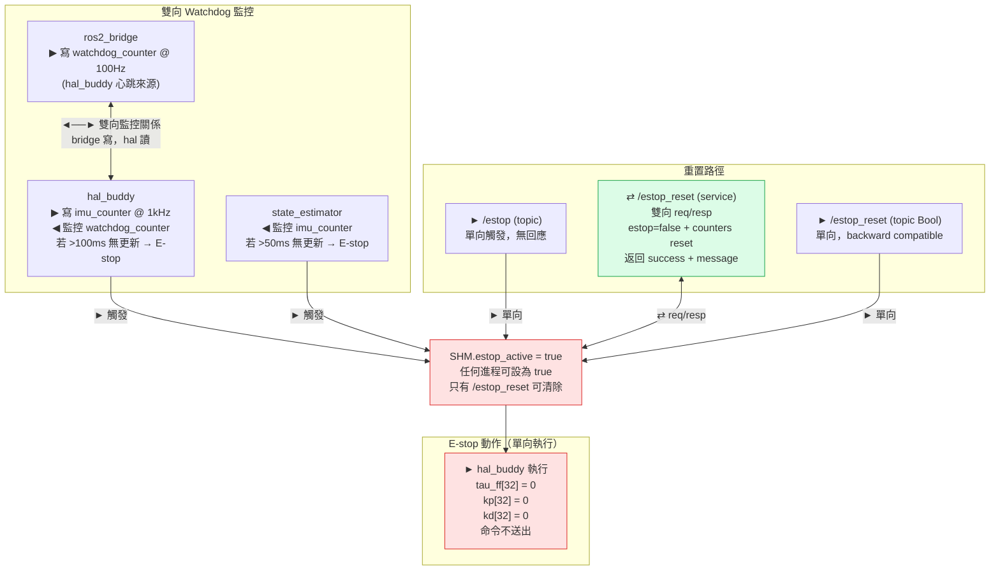

# 系統架構圖 — Orin Robot System Architecture

**文件版本：** v1.1  
**建立日期：** 2026-05-04  
**修訂日期：** 2026-05-04 — 補充單向/雙向方向標示、修正 JointCommand 閉迴路  
**目標平台：** NVIDIA AGX Orin (aarch64) · Ubuntu 22.04.5 LTS · JetPack 6.1  
**部署位址：** `nvidia@192.168.99.73:/home/nvidia/poc/poc-orin/`

---

## 0. 方向標示說明

| 符號 | 意義 |
|------|------|
| `──►` | 單向資料流（發送方→接收方，接收方無回應） |
| `◄──►` | 雙向資料流（雙方互相讀寫，通常各自負責不同欄位） |
| `⇄` | 請求/回應（如 ROS2 Service：Client 發 Request，Server 返回 Response） |
| `↺` | In-process 函式呼叫（非 IPC，同進程內部輸入→輸出） |
| `- - ►` | 選用路徑 / 待啟用 / fallback |

---

## 1. 實體系統架構（含資料流方向）

---

## 2. 控制迴路頻率層次與資料方向

> **閉迴路說明：** policy_node → `/policy/joint_commands` → ros2_bridge 訂閱 → `SHM.joint_cmd.q_des` → hal_buddy 讀取 → HardwareInterfaceStub::write()。這是完整的感知–推理–執行閉迴路（目前 stub 模式，write() 為 no-op）。

---

## 3. 安全機制架構（雙向監控）

---

## 4. 部署架構

| 方式 | 設定檔 | 資料流入口 | 自動重啟 |
|------|--------|----------|---------|
| **systemd** (主要) | `services/systemd/robot-core.service` | `bringup_all.sh` | `Restart=on-failure (10s)` |
| **Docker Compose** | `services/docker-compose/docker-compose.yml` | 各 service command | `restart: unless-stopped` |
| **k3s** | `services/k3s/deploy-*.yaml` | HAL + Policy Deployment | ReplicaSet |

---

## 5. 已知系統限制

| 項目 | 現狀 | 影響層 | 解法方向 |
|------|------|--------|---------|
| PREEMPT_RT 核心 | 僅 PREEMPT | HAL jitter 可能 >100μs | 安裝 RT patch 核心 |
| GPU 推理 | ONNX Runtime CPU | 推理延遲無 GPU 加速 | 完整 JetPack CUDA |
| TensorRT Python | `libnvdla` 缺失 | 無法用 Python TRT API | SDK Manager 完整安裝 |
| 硬體閉迴路 | HardwareInterfaceStub | write() 為 no-op | 替換為真實 SDK |
| sim=True | 全節點模擬模式 | 無實際馬達命令 | 逐節點切換 sim=False |
